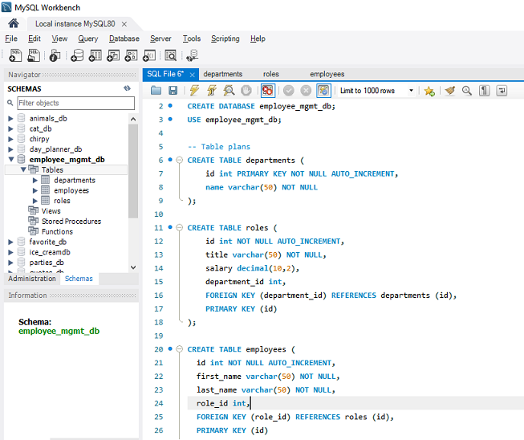
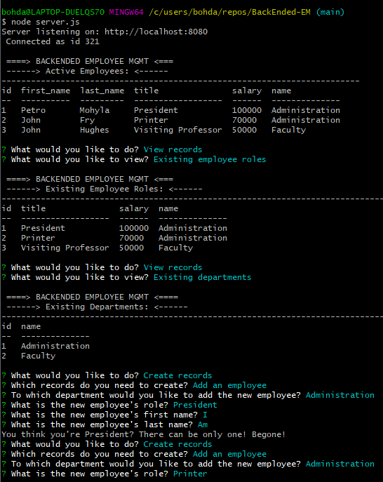
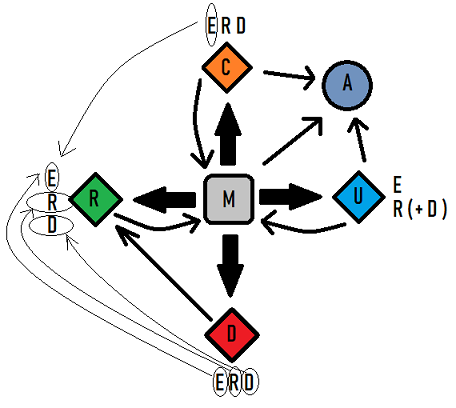

# BackEnded-EM
A node.js CLI app using CRUD principles to manage an employee database. 

  
## Features

### Database
* A MySQL database schema with 3 initial seeded records (./db/schema.sql and ./db/seeds.sql)
* The basic structure of 3 tables: Departments (D), Roles (R), Employees (E) - ERD schema
    * Fundamental layer - departments, middle layer - employee roles, topmost layer - employees
* MySQL npm module to manage DB connection
* Modularized DB connection (./db/connection/connection.js)

### Server
* Minimized, modularized server connection file (./server.js)
* The initial function that loads the app is imported

### App
* The engine of the application (./app/myApp.js)
* Inquirer npm package to obtain user input
* Console.table module to display database records in a table

* The functional code is organized by function, into 6 sections: 

    * M - Menu: functions that facilitate navigation through the app
    * A - Arrays: store the up-to-date departments and employee roles, used by the menu (M), create (C) and update (U) functions
    * C - Create: functions to create ERD (Employees-Roles-Departments)
        * Two-way interaction with the Menu
        * Interaction with Arrays to push the newly created records
        * Interaction with the read (R) functionality (E-to-E - employee create to view)
    * R - Read: functions to view ERD 
        * Main view - employee list - is a joint query of all 3 DB tables
        * Role view - the list of employee roles
        * Dept view - the department list
        * Two-way interaction with the Menu
    * U - Update: functions to update ERD
        * Interaction with the Arrays to update the information
        * Two-way interaction with the Menu
    * D - Delete: functions to remove ERD
        * One-way interaction from the Menu
        * One-way interaction to the Read functionality (diplaying the corresponding view after each deletion)

## Links

[Screencast demo of the app in action](https://www.awesomescreenshot.com/video/1802035?key=647b4d8cdb8097d1b1c06aa313c6cc8b)

[GitHub repository](https://github.com/bohdicave/BackEnded-EM)
    

